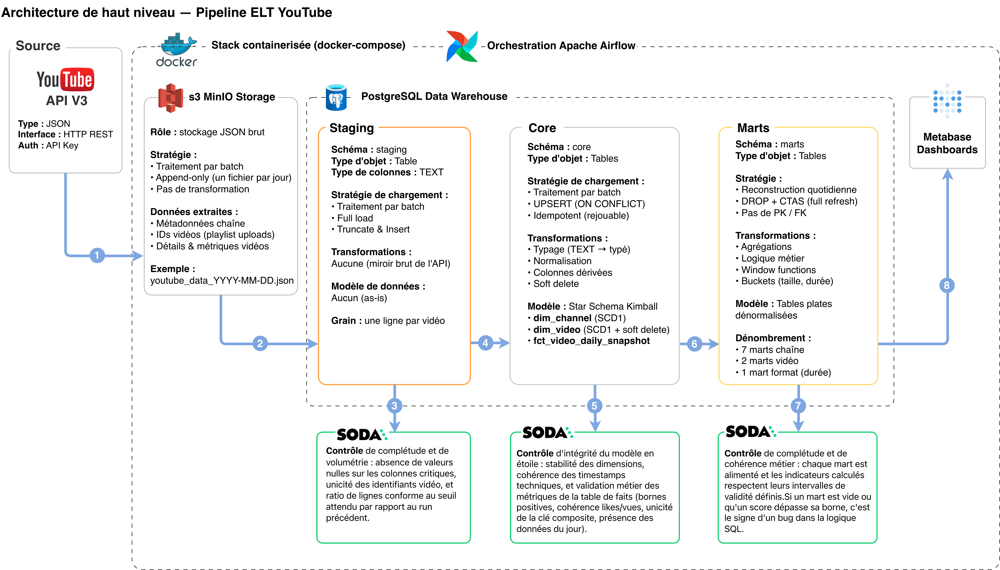
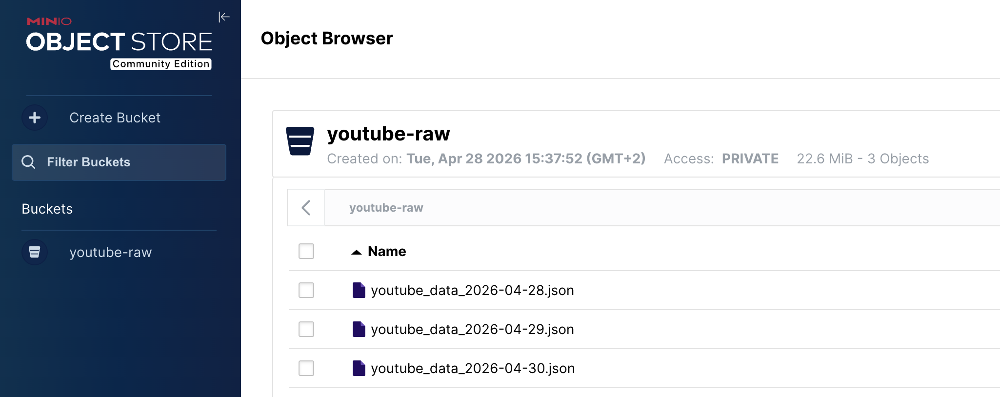
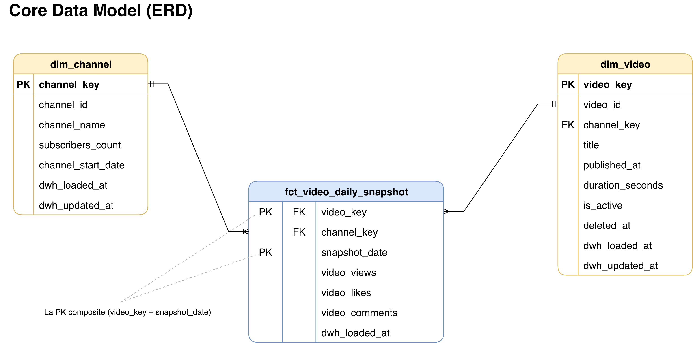
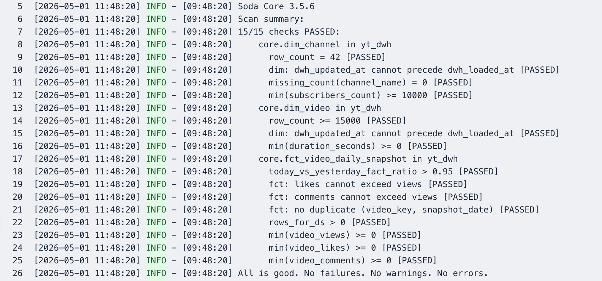
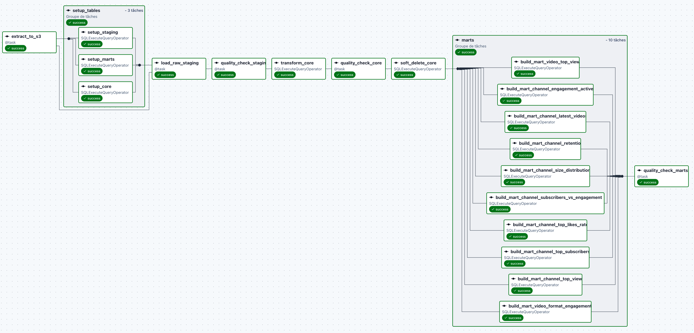
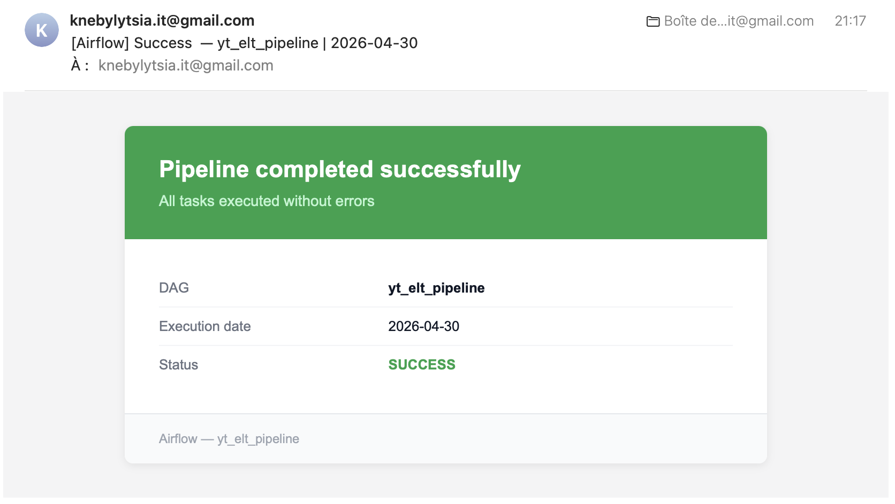
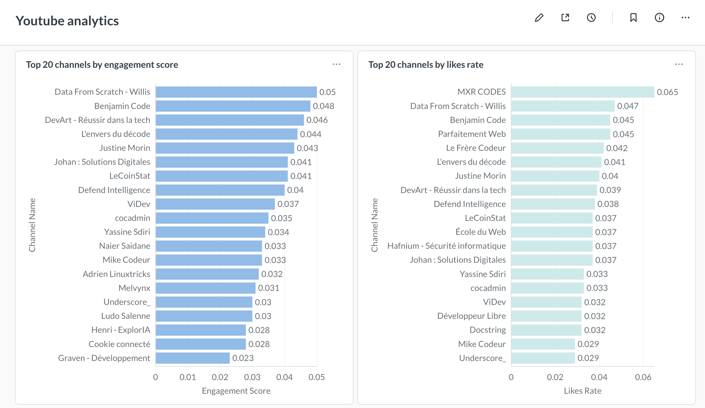
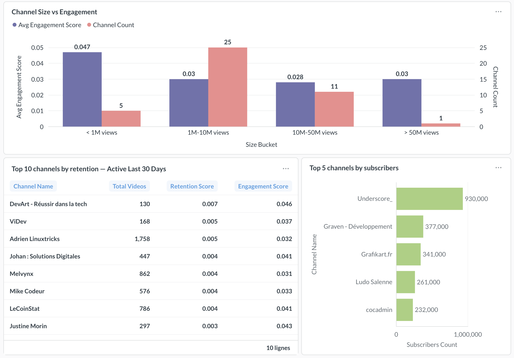
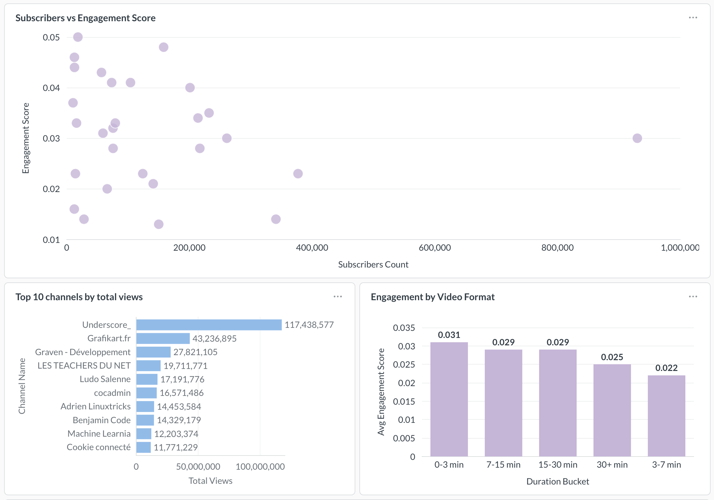

# Pipeline ELT YouTube — Analyse des chaînes tech francophones

[](https://github.com/NebylytsiaKyrylo/youtube-elt-pipeline/actions/workflows/ci.yml)

J'ai construit un pipeline ELT qui extrait quotidiennement les métadonnées et statistiques d'environ 40 chaînes YouTube tech francophones via l'API YouTube Data v3.

Les réponses brutes de l'API sont d'abord stockées en JSON dans MinIO, qui joue le rôle de data lake compatible S3. À partir de ce data lake, les données sont chargées dans un data warehouse PostgreSQL organisé en trois couches : `staging` (miroir brut typé en `TEXT`), `core` (modèle Kimball typé et dédupliqué — deux dimensions et une table de faits) et `marts` (10 tables analytiques dénormalisées prêtes pour la BI).

L'orchestration de bout en bout est faite avec Apache Airflow, la qualité des données est contrôlée à chaque couche par Soda Core (portes bloquantes), les marts sont exposés dans Metabase pour la consultation interactive, et toute la stack démarre en une seule commande grâce à Docker Compose.

**Stack :** Python, SQL (PostgreSQL 17), Docker, Apache Airflow 3.2, MinIO (S3), Soda Core, uv, ruff, SQLFluff, GitHub Actions et Metabase.

Le cahier des charges complet est dans [docs/requirements.md](docs/requirements.md).

## Table des matières

- [Besoin métier](#besoin-métier)
- [Comment j'ai construit ce projet](#comment-jai-construit-ce-projet)
- [Structure du dépôt](#structure-du-dépôt)
- [Comment lancer le projet](#comment-lancer-le-projet)

## Besoin métier

Une agence marketing française spécialisée dans la tech cherche à identifier les chaînes YouTube francophones les plus influentes dans le domaine technique — Data, IA, Développement Web, DevOps, Cybersécurité, Génie Logiciel — pour conseiller ses clients sur leurs partenariats et leurs formats de contenu.

L'agence fournit une liste curatée d'environ 40 chaînes (minimum 10 000 abonnés chacune). Mon travail consiste à actualiser quotidiennement les métadonnées des chaînes et des vidéos via l'API YouTube Data, à modéliser tout cela dans un entrepôt analytique, et à livrer **10 tables analytiques rafraîchies chaque jour** qui répondent à cinq familles de questions métier :

1. **Volume & portée** — qui domine en vues absolues et en abonnés
2. **Engagement & rétention** — qui transforme des vues en interactions
3. **Efficacité d'audience** — qui a la communauté la plus engagée par rapport à sa taille
4. **Activité de publication** — qui est encore actif et depuis quand
5. **Performance par format** — quelles durées de vidéo génèrent le meilleur engagement

Chaque mart répond à une question précise, avec ses métriques, ses filtres et ses critères d'acceptation. Le détail des 10 marts est documenté dans [docs/requirements.md](docs/requirements.md).

## Comment j'ai construit ce projet

Je présente le projet dans l'ordre réel où je l'ai construit : du cadrage métier jusqu'à la BI, en posant chaque brique avant d'attaquer la suivante. Chaque étape explique ce que j'ai fait, pourquoi je l'ai fait comme ça, et renvoie vers les fichiers concernés.

### 1. Conception — périmètre, architecture, modélisation

Avant d'écrire la moindre ligne de code, j'ai lu et reformulé le besoin métier dans [docs/requirements.md](docs/requirements.md) pour fixer le périmètre : la liste des ~40 chaînes, la fréquence de rafraîchissement (quotidienne), les 10 marts attendus avec leurs questions métier, leurs métriques et leurs critères d'acceptation. Ce travail de cadrage m'a évité de construire dans le vide et m'a servi de référence à chaque étape suivante.

J'ai ensuite choisi un flux **ELT** plutôt qu'ETL. Concrètement, je stocke d'abord les réponses brutes de l'API en JSON dans un data lake, puis je transforme les données à l'intérieur du warehouse avec du SQL. Cette séparation me permet deux choses : rejouer n'importe quelle date passée à partir du fichier brut sans re-solliciter l'API (et donc sans brûler de quota), et garder les transformations métier auditables et versionnées en SQL plutôt que cachées dans du code Python.

Le pipeline est organisé en **quatre couches physiques** :

- **raw** — fichiers JSON immuables dans un object store compatible S3 (un fichier par date d'extraction)
- **staging** — miroir brut du JSON en SQL, toutes les colonnes en `TEXT`, tronqué et rechargé à chaque exécution
- **core** — cette couche constitue la source de vérité. Le schéma est typé et structuré en étoile selon la méthode Kimball. Pour garantir la cohérence des données lors des rechargements, j'utilise une logique d'UPSERT permettant de mettre à jour les enregistrements existants en cas de conflit sur les clés primaires.
- **marts** — tables analytiques dénormalisées, reconstruites entièrement à chaque exécution avec un `DROP + CREATE TABLE AS`

Chaque couche a une seule responsabilité et une seule stratégie de chargement. Une couche corrompue peut toujours être reconstruite depuis la couche d'en dessous, ce qui isole les pannes et simplifie le débogage.



Pour la modélisation du `core`, j'ai retenu un **star schema** plutôt qu'un modèle 3NF normalisé. C'est le pattern dominant pour les warehouses analytiques : il réduit le nombre de jointures par requête, simplifie les plans d'exécution, et c'est le format pour lequel les outils BI comme Metabase sont optimisés. Le grain est sans ambiguïté : une ligne par `(vidéo, date de snapshot)` dans la table de faits, ce qui me permet de conserver l'historique journalier des métriques d'engagement.

Enfin, j'ai posé dès le départ des **conventions de nommage** (préfixes de schémas et de tables, préfixes de colonnes, nommage des fichiers raw) pour éviter d'avoir à renommer du code plus tard. Elles sont documentées dans [docs/naming_conventions.md](docs/naming_conventions.md), et l'ensemble des décisions structurantes (ELT, 4 couches, star schema, SCD Type 1, soft delete, full refresh) est consigné dans [docs/decisions.md](docs/decisions.md).

### 2. Fondations — outillage, infrastructure locale, CI

Avant d'écrire le moindre code métier, j'ai mis en place toute la chaîne d'outils. C'est ce qui me permet de coder ensuite sans interruption : à chaque commit, le linter, le formateur et les tests me disent immédiatement si quelque chose casse.

Pour la gestion des dépendances Python, j'ai choisi **`uv`** plutôt que pip ou poetry. C'est un gestionnaire écrit en Rust, beaucoup plus rapide à l'installation, et il produit un `uv.lock` déterministe — n'importe qui qui clone le projet obtient exactement les mêmes versions de dépendances que moi. La configuration tient dans [pyproject.toml](pyproject.toml), avec deux groupes : `prod` pour le pipeline, `dev` pour les outils de développement (lint, tests).

Pour la qualité du code, j'ai retenu **`ruff`** côté Python (lint + format en un seul outil, qui remplace flake8, isort et black) et **`sqlfluff`** côté SQL (lint sur tout l'arbre `sql/`, y compris le DML templaté avec Jinja). Les tests sont écrits avec **`pytest`**, organisés en deux catégories grâce à un marker dédié : tests unitaires exécutés en CI, et tests d'intégration qui toucheraient une vraie base PostgreSQL et qui sont exclus de la CI par défaut (tests d'intégration ne sont pas encore implémentée à ce stade du projet).

Toute la stack tourne en local avec **Docker Compose**. Le fichier [docker-compose.yaml](docker-compose.yaml) orchestre 9 services : trois bases PostgreSQL (une pour le warehouse, une pour les métadonnées Airflow, une pour les métadonnées Metabase), MinIO et son service d'init, les trois services Airflow (api server, scheduler, dag processor) et leur init, et Metabase. Chaque service stateful a son volume nommé, ses healthchecks et ses dépendances explicites. La séparation en trois bases Postgres est volontaire : isoler les métadonnées de chaque système des données du warehouse évite la contamination croisée et reflète ce qu'on retrouve en production. La reproductibilité est la fonctionnalité principale d'un projet portfolio — un `docker compose up -d --build` doit suffire à amener la stack entière à un état fonctionnel.

Pour finir, j'ai branché **GitHub Actions** sur chaque push et chaque pull request vers `master`. Le workflow [`.github/workflows/ci.yml`](.github/workflows/ci.yml) installe les dépendances avec `uv`, puis exécute dans cet ordre : `ruff check`, `ruff format --check`, `sqlfluff lint sql/`, et `pytest tests/unit/`. Le badge en haut du README reflète le statut courant de `master` — il devient rouge dès qu'un commit casse l'une de ces étapes, ce qui me permet de réagir tout de suite. Sur ce projet je travaille seul et je pushe directement sur `master` ; pour un usage à plusieurs, j'activerais la branch protection côté GitHub pour empêcher tout merge tant que la CI n'est pas verte.

### 3. Extraction depuis l'API YouTube

Pour récupérer les données depuis l'API YouTube Data v3, j'ai écrit un **client HTTP léger** plutôt que d'utiliser le SDK officiel de Google : je n'ai besoin que de trois endpoints (`channels`, `playlistItems`, `videos`), et un client maison reste plus simple à lire et plus facile à mocker dans les tests. Il est construit sur `requests.Session` avec `urllib3.Retry` (3 retries, backoff exponentiel sur 429 et 5xx). Le code est dans [src/youtube/client.py](src/youtube/client.py).

Au-dessus du client, l'extracteur ([src/youtube/extractor.py](src/youtube/extractor.py)) orchestre la chaîne complète pour chaque chaîne : métadonnées → playlist d'uploads → liste des video_id (avec pagination) → détails des vidéos par batchs de 50 (la limite imposée par l'API). Chaque vidéo est ensuite enrichie avec les métadonnées de sa chaîne pour simplifier le chargement en staging plus tard. La liste des chaînes à extraire est centralisée dans [src/youtube/channels.py](src/youtube/channels.py).

J'ai prévu la résilience dès cette couche : si une chaîne échoue, je log et je continue avec les suivantes ; le pipeline ne s'interrompt que si aucune chaîne ne retourne de données. Les deux comportements sont couverts par les tests unitaires [tests/unit/test_client.py](tests/unit/test_client.py) et [tests/unit/test_extractor.py](tests/unit/test_extractor.py).

### 4. Couche raw — stockage JSON immuable dans MinIO

Une fois les vidéos extraites de l'API, je les écris **telles quelles** en JSON dans un object store, avant toute transformation. C'est le principe de la couche raw : préserver la fidélité parfaite de la réponse API pour pouvoir rejouer n'importe quelle date passée sans re-solliciter YouTube. Un fichier par date d'extraction (`youtube_data_YYYY-MM-DD.json`), append-only, jamais modifié après écriture.

J'ai choisi **MinIO** plutôt qu'un système de fichiers local. MinIO expose la même API S3 que `boto3` : le code écrit ici est portable bit-à-bit vers AWS S3, seule l'URL du endpoint change. Un système de fichiers aurait été plus simple, mais aurait cassé l'abstraction "object storage" et imposé une réécriture pour un déploiement cloud. J'ai aussi gardé le **JSON brut** plutôt que Parquet : la réponse YouTube est nativement en JSON, le stockage tel quel évite toute interprétation de schéma à la frontière, et ça reste lisible à l'œil pour déboguer.

La classe [src/storage/raw_storage.py](src/storage/raw_storage.py) expose deux méthodes : `write` qui sérialise la liste des vidéos en JSON et l'upload dans le bucket, et `read` qui retélécharge et désérialise un fichier passé. Le tout est testé dans [tests/unit/test_raw_storage.py](tests/unit/test_raw_storage.py) avec un client S3 mocké.



### 5. Couche staging — miroir SQL du JSON

L'étape suivante consiste à charger le contenu du fichier JSON dans une table SQL, sans aucune transformation métier. C'est le rôle du **staging** : faire entrer les données dans le warehouse sous une forme aplatie, pour que le SQL prenne le relais à partir d'ici.

La table `staging.yt_video_snapshot` ([sql/staging/ddl_staging.sql](sql/staging/ddl_staging.sql)) a toutes ses colonnes en **`TEXT`**. Volontairement : si l'API YouTube change un type ou ajoute un champ, l'ingestion ne casse pas, et le casting/typage est fait plus loin dans la couche core. Pas de contrainte, pas de clé primaire, pas d'index — staging est jetable, c'est un sas.

La stratégie de chargement est un **TRUNCATE + INSERT** dans une seule transaction. Comme la table est rechargée intégralement à chaque exécution, je n'ai aucune logique de conflit à gérer, et l'opération est trivialement idempotente : rejouer la même date écrase le contenu précédent. La transaction garantit aussi que la table n'est jamais vue vide par un consommateur en cours de run.

Côté code, j'ai utilisé `pandas.DataFrame.to_sql` avec `method="multi"` et `chunksize=500` ([src/warehouse/loader.py](src/warehouse/loader.py)) pour générer des `INSERT` multi-lignes. À ce volume (~20k lignes), c'est largement suffisant. Le loader est testé dans [tests/unit/test_loader.py](tests/unit/test_loader.py) avec un engine SQLAlchemy mocké.

### 6. Couche core — star schema, soft delete, snapshots quotidiens

Cette couche est la **source unique de vérité** du warehouse. Elle prend les données brutes du staging et les transforme en un modèle typé, dédupliqué, normalisé sur les bonnes clés. Tout ce qui vient après (marts, BI) repose sur elle.

J'ai modélisé le core en **star schema Kimball** avec deux dimensions et une table de faits ([sql/core/ddl_core.sql](sql/core/ddl_core.sql)) :

- **`dim_channel`** — une ligne par chaîne (nom, nombre d'abonnés, date de création).
- **`dim_video`** — une ligne par vidéo (titre, durée, date de publication), avec `channel_key` en foreign key.
- **`fct_video_daily_snapshot`** — la table de faits, une ligne par `(video_key, snapshot_date)` avec les métriques du jour (vues, likes, commentaires).



Les dimensions ont chacune une **surrogate key `SERIAL`** (`channel_key`, `video_key`) et conservent la natural key YouTube (`channel_id`, `video_id`) en colonne `UNIQUE`. Les jointures se font sur des entiers plutôt que sur du texte — index plus petits, plans d'exécution plus rapides — et le schéma reste isolé d'éventuels changements de format des identifiants côté YouTube.

Sur les dimensions, j'ai retenu un **SCD Type 1** : en cas de conflit sur la natural key, j'écrase les attributs (nom, nombre d'abonnés, titre, durée) avec les valeurs du jour. Aucune historisation côté dimension. Les questions métier ont besoin de l'état **courant** de chaque chaîne et vidéo ; un SCD Type 2 ajouterait des colonnes `valid_from` / `valid_to` et un pattern d'upsert plus complexe pour une valeur analytique qu'aucun mart n'utilise. L'historique est conservé là où il est utile : dans la table de faits.

Sur `dim_video`, j'ai implémenté un **soft delete** plutôt qu'un hard delete. Quand une vidéo disparaît de l'extraction du jour (suppression par le créateur, mise en privé, retrait par YouTube), je la marque `is_active = FALSE` avec `deleted_at = NOW()`. Si elle réapparaît plus tard, je la réactive. Un `DELETE` aurait orpheliné toutes les lignes de faits historiques référençant cette vidéo et cassé l'analytique. Un index partiel `WHERE is_active = FALSE` garde les requêtes de soft delete rapides. Le DML soft delete est dans [sql/core/dml_soft_delete.sql](sql/core/dml_soft_delete.sql).

La table de faits, elle, **accumule l'historique jour après jour**. Clé primaire composite `(video_key, snapshot_date)` : rejouer la même date est idempotent (le `ON CONFLICT` met à jour les métriques de ce jour-là sans toucher au reste). C'est ce qui permet aux marts de répondre à des questions du type "comment l'engagement a-t-il évolué" — un fait cumulatif écrasé chaque jour rendrait toute analyse temporelle impossible. Un index `(channel_key, snapshot_date)` accélère les agrégations par chaîne. Toute la logique d'upsert (dimensions + fait) est dans [sql/core/dml_core.sql](sql/core/dml_core.sql).

Enfin, chaque dimension porte les colonnes techniques `dwh_loaded_at` et `dwh_updated_at` pour tracer l'insertion et la dernière mise à jour, et la table de faits porte `dwh_loaded_at NOT NULL` rafraîchi à chaque écrasement.

### 7. Couche marts — 10 tables analytiques

Les marts sont la **couche de consommation** du warehouse : des tables dénormalisées, prêtes à être affichées dans Metabase ou requêtées directement. Chaque mart répond à une question métier précise du cahier des charges et a sa propre spécification (métriques, filtres, critères d'acceptation) détaillée dans [docs/requirements.md](docs/requirements.md).

Tous les marts suivent la même stratégie de chargement : **`DROP TABLE IF EXISTS` + `CREATE TABLE AS SELECT`**. C'est le pattern le plus simple pour une idempotence parfaite — pas de logique de conflit, pas de delta à calculer, pas de risque d'état partiel. Le compute "gaspillé" à reconstruire chaque mart à chaque run est négligeable à ce volume, et le code SQL reste auditable d'un seul coup d'œil. Le DDL du schéma est dans [sql/marts/ddl_marts.sql](sql/marts/ddl_marts.sql) (un simple `CREATE SCHEMA IF NOT EXISTS marts`).

Côté SQL, les marts m'ont permis de mettre en pratique l'essentiel du SQL analytique : **CTEs** (`WITH`) pour structurer les requêtes en étapes lisibles, **window functions** (`DENSE_RANK() OVER (ORDER BY …)`) pour les classements avec gestion des ex-æquo, **agrégations** (`SUM`, `COUNT`, `AVG`, `MAX`) avec `GROUP BY` multi-colonnes et `HAVING` pour les filtres post-agrégation, **jointures** sur le star schema (fait + deux dimensions), **`CASE`** pour la bucketisation, **arithmétique de dates** (`INTERVAL`, `AGE`, `EXTRACT`), et casting explicite (`::NUMERIC`, `::DATE`). Le code source de chaque mart est dans [sql/marts](sql/marts).

### 8. Data catalog — documentation des couches consommables

Une fois le `core` et les `marts` en place, j'ai rédigé un **data catalog** ([docs/data_catalog.md](docs/data_catalog.md)) qui documente chaque table et chaque colonne des couches exposées aux consommateurs (analystes, outils BI, applications en aval). Pour chaque table : son rôle, son grain, sa natural key, et un tableau colonne par colonne avec le type de donnée et la description métier.

J'ai volontairement exclu le `staging` et la couche raw du catalog : ce sont des éléments internes au pipeline, pas une interface publique. Le catalog n'a de sens que sur les couches dont les schémas sont stables et destinés à être requêtés.

C'est un livrable typique d'un projet data : il évite à un analyste de devoir lire le SQL pour comprendre ce que contient une colonne, et il sert de point d'entrée à n'importe quelle nouvelle personne qui reprendrait le projet.

### 9. Qualité des données — Soda Core

Avoir des données dans le warehouse ne suffit pas — il faut garantir qu'elles sont **utilisables**. J'ai utilisé **Soda Core** (bibliothèque Python, syntaxe YAML) pour automatiser ces contrôles à chaque couche du pipeline. Trois suites de checks, une par couche, dans [soda](soda) : `checks_staging.yml`, `checks_core.yml`, `checks_marts.yml`.

Les contrôles sont organisés par **catégorie** :

- **Volume** — nombre de lignes attendu, ratio aujourd'hui/hier (par exemple `staging_vs_yesterday_fact_ratio > 0.95` détecte une chute brutale du volume extrait).
- **Complétude** — `missing_count = 0` sur les champs obligatoires (`video_id`, `channel_id`, `title`, etc.), `duplicate_count = 0` sur les natural keys.
- **Intégrité** — cohérence des timestamps techniques (`dwh_updated_at >= dwh_loaded_at`), absence de doublons sur la clé primaire composite de la table de faits.
- **Invariants métier** — métriques non négatives, `likes <= views`, `comments <= views`, `subscribers_count >= 10000` (cohérent avec le périmètre), bornes des scores des marts (`engagement_score ∈ [0, 2]`, `retention_score ∈ [0, 1]`, `likes_rate ∈ [0, 1]`).
- **Fraîcheur** — la table de faits contient bien des lignes pour la date courante, et la `snapshot_date` maximale est égale à la date d'exécution.

Le point clé : ces contrôles s'exécutent comme **portes bloquantes** dans le DAG Airflow. Un check qui échoue lève une `ValueError` et interrompt le run avant que les données corrompues ne se propagent vers les marts et les dashboards. Le coût d'un faux positif (un run légitime bloqué) est largement inférieur au coût d'un faux négatif (mauvaises données dans la BI). Pour absorber le bruit, j'utilise des seuils de ratio (`> 0.95`) plutôt que des égalités strictes là où c'est pertinent.



L'exécution de Soda depuis Airflow passe par un petit utilitaire ([src/soda_utils/soda_checks.py](src/soda_utils/soda_checks.py)) qui charge la configuration de la datasource ([soda/configuration.yml](soda/configuration.yml)), lance le scan, et lève une exception si au moins un check est en échec.

### 10. Orchestration — Airflow

Une fois chaque brique fonctionnelle en isolation, je les ai assemblées dans un DAG Airflow ([dags/yt_elt_dag.py](dags/yt_elt_dag.py)). C'est l'étape qui transforme un ensemble de scripts en pipeline de production : exécution planifiée, retries automatiques, dépendances explicites, alerting, et observabilité de chaque tâche.

Le pipeline enchaîne les étapes suivantes :

1. **`extract_to_s3`** — extraction depuis l'API YouTube et écriture du JSON brut dans MinIO.
2. **`setup_tables`** — création/vérification des schémas et tables (staging, core, marts), les trois DDL s'exécutent en parallèle dans un TaskGroup.
3. **`load_raw_staging`** — relecture du JSON depuis MinIO et chargement dans la table de staging.
4. **`quality_check_staging`** — porte qualité Soda sur staging (volume, complétude, doublons).
5. **`transform_core`** — upserts des dimensions et insertion dans la table de faits.
6. **`quality_check_core`** — porte qualité Soda sur core (intégrité référentielle, invariants métier, fraîcheur).
7. **`soft_delete_core`** — marquage des vidéos absentes de l'extrait du jour comme `is_active = FALSE`.
8. **`marts`** — construction des 10 marts en parallèle dans un TaskGroup.
9. **`quality_check_marts`** — porte qualité Soda sur les marts (`row_count > 0`, bornes des scores).



Côté implémentation, j'ai mélangé **`@task` décorateurs** pour les étapes Python et **`SQLExecuteQueryOperator`** pour les étapes SQL pures, ce qui garde chaque tâche dans son langage naturel.

### 11. Notifications email

Un pipeline qui tourne sans alerting est un pipeline qu'on ne surveille pas. J'ai branché des notifications email SMTP sur deux événements : un échec de tâche et un succès du DAG.

Les deux notifications utilisent le `SmtpNotifier` d'Airflow avec des templates HTML ([templates/email_success.html](templates/email_success.html), [templates/email_failure.html](templates/email_failure.html)).



### 12. BI — dashboards Metabase

J'ai connecté **Metabase** au schema `marts` du warehouse pour faire quelques visualisations sur les 10 tables analytiques.







### 13. Validation end-to-end

Une fois toutes les briques en place, j'ai validé le pipeline de bout en bout sur une base vide : vidage complet du warehouse et du bucket MinIO, puis déclenchement manuel du DAG. Toutes les tâches passent au vert, les trois portes Soda valident, les comptages sont cohérents dans `dim_channel`, `dim_video` et `fct_video_daily_snapshot`, et chaque mart contient des lignes.

J'ai aussi vérifié les deux comportements critiques :

- **Idempotence** — re-déclencher le DAG sur la même date produit un état strictement identique (aucun doublon, aucune ligne en trop, aucun écart sur les métriques).
- **Alerting** — j'ai simulé un échec en cassant volontairement une tâche pour confirmer la réception de l'email d'échec, et je vérifie quotidiennement la réception de l'email de succès.

---

## Structure du dépôt

```text
.
├── .github/
│   └── workflows/
│       └── ci.yml                    # Workflow CI : lint Python + SQL, format check, tests unitaires
│
├── dags/
│   └── yt_elt_dag.py                 # DAG Airflow — orchestre l'ensemble du pipeline
│
├── docs/                             # Documentation du projet
│   ├── architecture.drawio           
│   ├── architecture.png              # Diagramme d'architecture
│   ├── ERD_data_model_core.drawio    
│   ├── ERD_data_model_core.png       # Modèle de données du core
│   ├── img/                          
│   ├── data_catalog.md               # Metadata pour core et marts
│   ├── decisions.md                  
│   ├── naming_conventions.md         # Conventions de nommage
│   ├── requirements.md               # Cahier des charges
│   └── runbook.md                    # Comment lancer le projet
│
├── soda/                             # Suites de contrôles qualité Soda Core
│   ├── configuration.yml             # Configuration de la datasource Postgres
│   ├── checks_staging.yml            
│   ├── checks_core.yml               
│   └── checks_marts.yml              
│
├── sql/                              # Tout le SQL du pipeline, par couche
│   ├── staging/
│   │   └── ddl_staging.sql           
│   ├── core/
│   │   ├── ddl_core.sql              
│   │   ├── dml_core.sql              
│   │   └── dml_soft_delete.sql       # Marquage des vidéos disparues
│   └── marts/
│       ├── ddl_marts.sql             
│       └── mart_*.sql                # Les 10 marts en DROP + CREATE TABLE AS
│
├── src/                              # Code Python du pipeline
│   ├── youtube/                      # Extraction depuis l'API YouTube Data v3
│   │   ├── client.py                 # Client HTTP avec retry et session
│   │   ├── extractor.py              # Orchestration de l'extraction par chaîne
│   │   └── channels.py               # Liste statique des chaînes à extraire
│   ├── storage/                      # Couche raw — stockage objet
│   │   └── raw_storage.py            # Lecture/écriture JSON dans MinIO (S3-compatible)
│   ├── warehouse/                    # Accès au warehouse Postgres
│   │   ├── pg_client.py              # Helpers de connexion Postgres
│   │   └── loader.py                 # Loader staging (TRUNCATE + INSERT pandas)
│   └── soda_utils/                   # Wrapper d'exécution Soda Core depuis Airflow
│       └── soda_checks.py
│
├── templates/                        # Templates HTML des notifications email
│   ├── email_success.html
│   └── email_failure.html
│
├── tests/                            # Tests unitaires (intégration prévus mais non implémentés)
│   ├── conftest.py
│   └── unit/
│       ├── test_client.py
│       ├── test_extractor.py
│       ├── test_loader.py
│       └── test_raw_storage.py
│
├── .env.example                      # Template des variables d'environnement
├── .gitignore
├── .dockerignore                     
├── .python-version                   # Version Python épinglée
├── Dockerfile                        # Image Airflow
├── docker-compose.yaml               # Services
├── pyproject.toml                    # Dépendances + config ruff/sqlfluff/pytest
├── uv.lock                           # Lockfile uv
├── requirements.txt                  # Export uv des dépendances pour Dockerfile
└── README.md                         # Ce fichier
```

> Au premier démarrage, Airflow génère un fichier `simple_auth_manager_passwords.json.generated` à la racine du projet contenant le mot de passe admin de l'UI. Ce fichier est local et ne doit pas être versionné — il est listé dans le `.gitignore`.

---

## Comment lancer le projet

Pour reproduire le projet en local (prérequis, préparation du `.env`, démarrage de la stack, vérification des services et création des Variables/Connexions Airflow), j'ai rédigé un runbook dédié : [docs/runbook.md](docs/runbook.md).

---

Licence [MIT](LICENSE)


